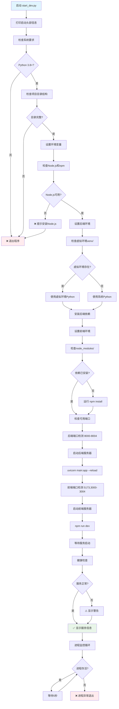
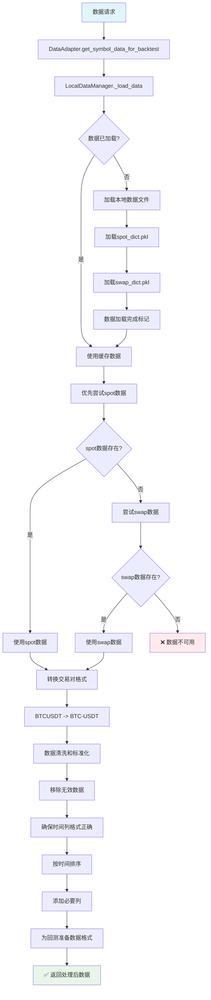
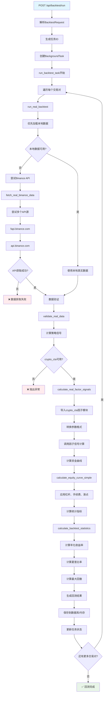
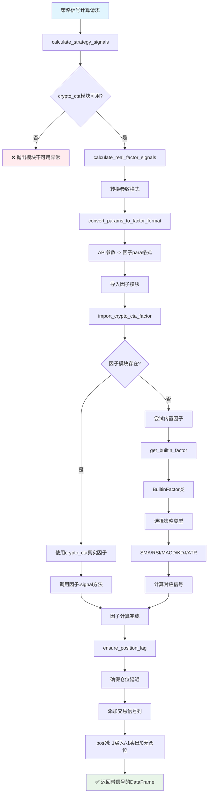
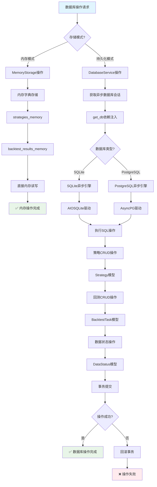
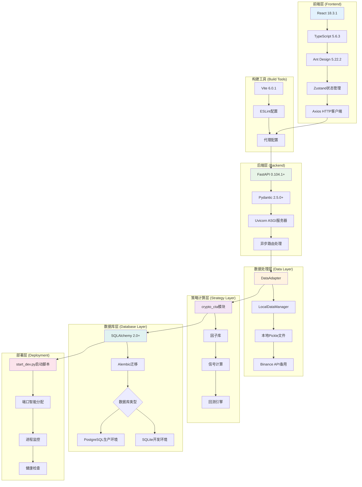

# NagaFlow 系统流程图文档

本文档基于NagaFlow工程代码的实际实现，详细展示各个核心模块的工作流程。

## 1. 应用启动流程图

基于 `start_dev.py` 的实际实现：



## 2. FastAPI应用生命周期流程

基于 `backend/main.py` 的实际实现：

```mermaid
flowchart TD
    A[FastAPI应用启动] --> B[执行lifespan函数]
    B --> C[设置日志配置]
    C --> D[添加模块路径到sys.path]
    D --> E{使用内存存储?}
    
    E -->|否| F[初始化数据库连接]
    F --> G[await init_db]
    G --> H[创建SQLAlchemy引擎]
    H --> I[设置连接池]
    I --> J[数据库服务切换到持久化模式]
    
    E -->|是| K[数据库服务切换到内存模式]
    K --> L[配置CORS中间件]
    J --> L
    
    L --> M[注册静态文件服务]
    M --> N[注册API路由]
    N --> O[/api/data - 数据管理]
    O --> P[/api/backtest - 回测]
    P --> Q[/api/strategies - 策略管理]
    Q --> R[端口可用性检测]
    
    R --> S[启动Uvicorn服务器]
    S --> T[应用运行中...]
    T --> U[接收到关闭信号]
    U --> V{使用持久化存储?}
    V -->|是| W[关闭数据库连接]
    V -->|否| X[清理内存数据]
    W --> Y[应用关闭完成]
    X --> Y
    
    style A fill:#e1f5fe
    style Y fill:#fff3e0
    style T fill:#e8f5e8
```

## 3. 数据获取与处理流程

基于 `backend/app/services/data_adapter.py` 和 `local_data_manager.py` 的实际实现：



## 4. 回测执行详细流程

基于 `backend/app/api/backtest.py` 的实际实现：



## 5. 策略信号计算流程

基于 `crypto_cta` 模块集成的实际实现：



## 6. 数据库操作流程

基于 SQLAlchemy 异步实现：



## 7. 前端-后端交互流程

基于实际的API接口实现：

```mermaid
flowchart TD
    A[前端React组件] --> B[Axios HTTP请求]
    B --> C[Vite代理配置]
    C --> D[/api路径代理]
    D --> E[FastAPI后端]
    
    E --> F{请求路径?}
    F -->|/api/data/*| G[数据管理API]
    F -->|/api/strategies/*| H[策略管理API]
    F -->|/api/backtest/*| I[回测API]
    
    G --> J[获取交易对列表]
    J --> K[DataAdapter.get_usdt_symbols_async]
    K --> L[LocalDataManager.get_available_symbols]
    L --> M[返回USDT交易对]
    
    H --> N[策略CRUD操作]
    N --> O{存储模式?}
    O -->|内存| P[内存策略存储]
    O -->|数据库| Q[SQLAlchemy操作]
    P --> R[返回策略数据]
    Q --> R
    
    I --> S[回测任务管理]
    S --> T[BackgroundTasks]
    T --> U[异步回测执行]
    U --> V[进度状态更新]
    V --> W[WebSocket推送(计划中)]
    
    M --> X[JSON响应]
    R --> X
    V --> X
    X --> Y[前端状态更新]
    Y --> Z[UI重新渲染]
    Z --> AA[✅ 用户界面更新]
    
    style A fill:#e1f5fe
    style AA fill:#e8f5e8
    style W fill:#fff3e0
```

## 8. 系统整体架构流程

基于完整的技术栈实现：



## 总结

以上流程图严格基于NagaFlow工程代码的实际实现，详细展示了：

1. **启动流程**: 从环境检查到服务启动的完整过程
2. **应用生命周期**: FastAPI应用的初始化和关闭流程
3. **数据处理**: 本地数据文件到回测数据的转换过程
4. **回测执行**: 从请求到结果的完整回测流程
5. **策略计算**: crypto_cta模块的因子计算流程
6. **数据库操作**: 内存和持久化存储的双模式支持
7. **前后端交互**: HTTP API的完整请求响应流程
8. **系统架构**: 多层架构的组件交互关系

这些流程图可以帮助开发者快速理解系统的工作机制，便于维护和扩展开发。 